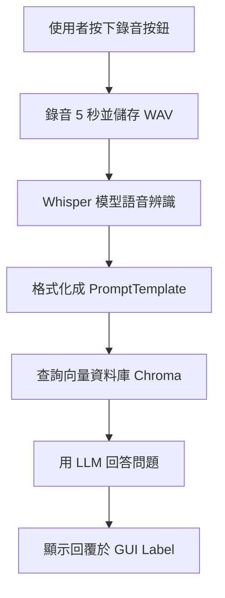

# AI RAG 導覽系統說明文件

## 🎯 1. 目的

本專案旨在開發一套簡易的 AI RAG（Retrieval-Augmented Generation）導覽系統，為了測試導覽系統建置需求，結合語音辨識與語意理解，達成智慧導覽與語音問答功能。

---

## 📦 2. 套件說明

| 類別 | 套件名稱 | 功能說明 |
|------|-----------|---------|
| 語音錄製 | `sounddevice`, `scipy` | 錄製麥克風輸入並儲存為 WAV 檔案 |
| 語音辨識 | `whisper` | 使用 OpenAI Whisper 模型進行語音辨識 |
| LLM 引擎 | `langchain`, `Ollama` | 串接 LLM 模型並處理 Prompt、QA 流程 |
| RAG 檢索 | `Chroma`, `OllamaEmbeddings` | 將文件向量化並建構知識庫進行語意檢索 |
| Web API | `FastAPI`, `langserve` | 提供外部介接 API |
| GUI | `tkinter` | 建立使用者操作介面與語音輸入按鈕 |

---

## 🎤 3. 語音辨識套件比較

| 套件 | 優點 | 缺點 |
|------|------|------|
| **Whisper** | 準確率高，支援多語言 | 模型大，推論速度慢 |
| **Vosk** | 本地執行輕量快速 | 中文辨識效果有限 |
| **FunASR** | 中英文混合支援好，輕量 | 安裝環境較複雜，較新穩定性略低 |

目前專案採用 **Whisper-large** 模型，雖然速度稍慢，但辨識效果穩定且支援中文語境。

---

## ✅ 4. 執行結果

使用者透過 GUI 按鈕進行語音錄製，並自動轉成文字，再送入 LangChain 模組處理並回應導覽說明。整體流程自動化，使用者無須手動操作，流程如下：

```
使用者 → 語音輸入 → Whisper 辨識 → Prompt 包裝 → LLM 回答 → 顯示導覽結果
```

範例輸出：

```
金門是一個充滿歷史和文化的城市。以下是金門的一些著名景點：
1. 莒光樓
2. 文台寶塔
3. 明遺老街
```

---

## 🛠️ 5. 可改善項目

- Whisper 推論速度提升：可改用 `medium` 或 `small` 模型提升速度。
- 支援語音中斷與重錄。
- 增加錄音進度條與辨識進度提示。
- 導覽內容可使用更一致的語氣與風格套件包裝。
- 多語言支援與翻譯模組整合。

---

## 📊 流程圖



---

📁 作者：你自己  
📅 版本：v1.0  
🧠 技術：LangChain + Whisper + Tkinter + RAG  
